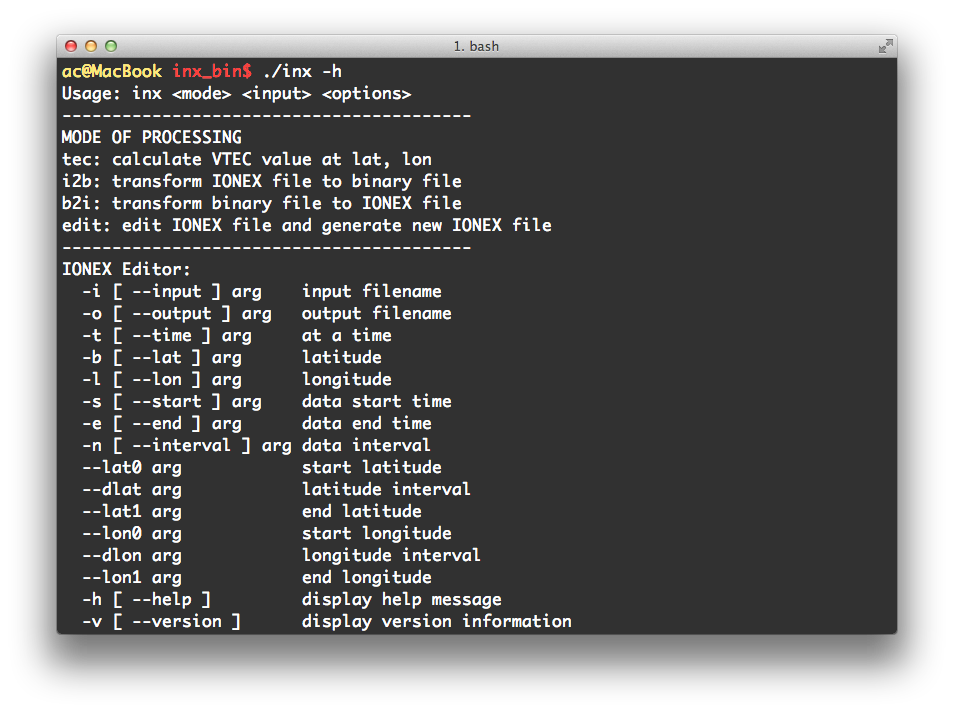

# INX_Editor

INX Editor是一款IONEX格式电离层数据编辑软件。它支持Windows, Linux以及Mac OS三大主流操作系统。它能够实现对IONEX电离层数据产品在时间维度、地理经纬度层面的编辑操作，如数据的加密、抽稀以及自定义截取，还能够计算任一位置的电离层总电子含量(TEC)，并且支持IONEX格式与二进制格式的相互转换。

INX Editor下载地址： [ftp://ftp.ionosphere.cn/software/inx_editor/](ftp://ftp.ionosphere.cn/software/inx_editor/)

命令行操作模式： 
```bash
 inx <mode> <input> <options>
```


### 具体功能与软件操作如下：

1. 键入`inx -h`输出帮助信息，显示软件操作指令

2. 计算任一位置的电离层TEC
```bash
inx tec --input whub3580.16i --time 6 --lat 30 --lon 120
```
或者
```bash
inx tec -i whub3580.16i -t 6 -b 30 -l 120
```
回车后，软件读取IONEX格式的电离层数据whub3580.16i, 计算并输出UT时为6时、纬度30°、经度120°的电离层TEC。

3. 加密或抽稀数据
```bash
inx edit -i whub3580.16i -n 3600 -o whub3580.16i_new
```
通过改变采样率(单位为秒)对数据进行加密或抽稀，并生成新的数据文件。采样率一般为小时的倍数，如设为3600即为每小时一组数据，如设为10800即为每三小时一组数据，如设为1800即为每半小时一组数据。

4. 截取自定义时间范围的数据
```bash
inx edit -i whub3580.16i -s 3 -n 3600 -e 9 -o whub3580.16i_new
```
设置起始时间、采样率、截止时间来截取原数据文件中的部分数据并生成新的数据文件。

5. 截取自定义经纬度范围的数据
```bash
inx edit -i whub3580.16i --lat0 30 --dlat 10 --lat1 80 --lon0 80 --dlon 20 --lon1 160 -o whub3580.16i_new
```
设置起至经纬度以及相应的间隔截取原数据文件中的部分数据并生成新的数据文件。将截取并生成纬度范围从30°至80°间隔为10°、经度范围从80°至160°间隔为20°的数据。

6. 截取自定义时间、经纬度范围的数据
```bash
inx edit -i whub3580.16i -s 5 -n 3600 -e 18 --lat0 20 --dlat 5 --lat1 75 --lon0 10 --dlon 5 --lon1 160 -o whub3580.16i_new
```
将截取并生成时间从5时至18时间隔一小时、纬度范围从20°至75°间隔为5°、经度范围从10°至160°间隔为5°的数据。

7. 将IONEX格式数据转化为二进制文件
```bash
inx i2b -i whub3580.16i -o whub3580.dat
```
将IONEX格式的电离层数据whub3580.16i转化为二进制文件whub3580.dat。

8. 将二进制文件转化为IONEX格式数据
```bash
inx b2i -i whub3580.dat -o whub3580.16i
```
将二进制文件whub3580.dat转化为IONEX格式的电离层数据whub3580.16i。

